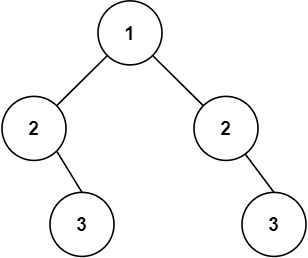

# [101. Symmetric Tree](https://leetcode.com/problems/symmetric-tree/)

## Problem

Given the `root` of a binary tree, check whether it is a mirror of itself (i.e., symmetric around its center).


Example 1:


```
Input: root = [1,2,2,3,4,4,3]
Output: true
```

Example 2:



```
Input: root = [1,2,2,null,3,null,3]
Output: false
``` 

Constraints:

- The number of nodes in the tree is in the range `[1, 1000]`.
- `-100 <= Node.val <= 100`


## Solution

```go
func isSymmetric(root *TreeNode) bool {
	if root == nil {
		return true
	}

	if root.Left == nil && root.Right == nil {
		return true
	}

	if root.Left != nil && root.Right == nil || root.Right != nil && root.Left == nil {
		return false
	}

	queue := []*TreeNode{root.Left, root.Right}
	for len(queue) > 0 {
		size := len(queue)
		temp := []int{}

		for size > 0 {
			curr := queue[0]
			queue = queue[1:]
			if curr == nil {
				temp = append(temp, math.MaxInt32)
			} else {
				temp = append(temp, curr.Val)
				queue = append(queue, curr.Left, curr.Right)
			}
			size--
		}
		for i := 0; i < len(temp)/2; i++ {
			if temp[i] != temp[len(temp)-1-i] {
				return false
			}
		}
	}
	return true
}
```