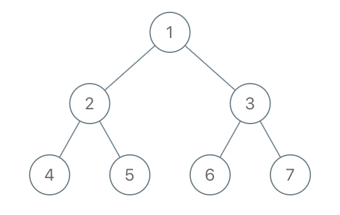

# [1110. Delete Nodes And Return Forest](https://leetcode.com/problems/delete-nodes-and-return-forest/)

## Problem

Given the `root` of a binary tree, each node in the tree has a distinct value.

After deleting all nodes with a value in `to_delete`, we are left with a forest (a disjoint union of trees).

Return the roots of the trees in the remaining forest. You may return the result in any order.


Example 1:



```
Input: root = [1,2,3,4,5,6,7], to_delete = [3,5]
Output: [[1,2,null,4],[6],[7]]
```

Example 2:

```
Input: root = [1,2,4,null,3], to_delete = [3]
Output: [[1,2,4]]
``` 

Constraints:

- The number of nodes in the given tree is at most `1000`.
- Each node has a distinct value between `1` and `1000`.
- `to_delete.length <= 1000`
- `to_delete` contains distinct values between `1` and `1000`.

## Solution

```go
func delNodes(root *TreeNode, toDelete []int) []*TreeNode {
	result := []*TreeNode{}
	deleteSet := make(map[int]bool)
	for _, val := range toDelete {
		deleteSet[val] = true
	}

	var dfs func(node *TreeNode, isRoot bool) *TreeNode
	dfs = func(node *TreeNode, isRoot bool) *TreeNode {
		if node == nil {
			return nil
		}

		toBeDeleted := deleteSet[node.Val]

		if isRoot && !toBeDeleted {
			result = append(result, node)
		}

		if toBeDeleted {
			node.Left = dfs(node.Left, true)
			node.Right = dfs(node.Right, true)
			return nil
		}

		node.Left = dfs(node.Left, false)
		node.Right = dfs(node.Right, false)
		return node
	}

	dfs(root, true)

	return result
}
```