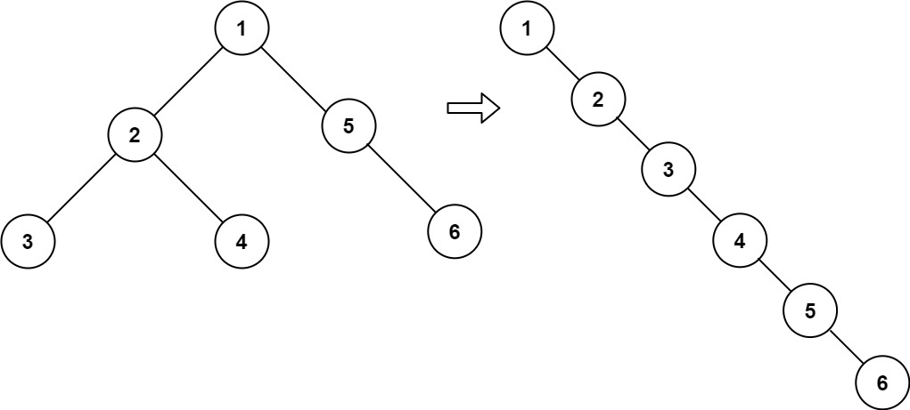

# [114. Flatten Binary Tree to Linked List](https://leetcode.com/problems/flatten-binary-tree-to-linked-list/)

## Problem

Given the `root` of a binary tree, flatten the tree into a "linked list":

- The "linked list" should use the same `TreeNode` class where the `right` child pointer points to the next node in the list and the `left` child pointer is always `null`.
- The "linked list" should be in the same order as a pre-order traversal of the binary tree.


Example 1:



```
Input: root = [1,2,5,3,4,null,6]
Output: [1,null,2,null,3,null,4,null,5,null,6]
```

Example 2:

```
Input: root = []
Output: []
```

Example 3:

```
Input: root = [0]
Output: [0]
``` 

Constraints:

- The number of nodes in the tree is in the range `[0, 2000]`.
- `-100 <= Node.val <= 100`
 

Follow up: Can you flatten the tree in-place (with `O(1)` extra space)?


## Solution

```go
func flatten(root *TreeNode) {
	stack := []*TreeNode{}
	stack = preorder(root, stack)

	for i := len(stack) - 1; i >= 0; i-- {
		stack[i].Left = nil
		if i < len(stack)-1 {
			stack[i].Right = stack[i+1]
		}
	}
}

func preorder(root *TreeNode, stack []*TreeNode) []*TreeNode {
	if root == nil {
		return stack
	}

	stack = append(stack, root)

	if root.Left != nil {
		stack = preorder(root.Left, stack)
	}
	if root.Right != nil {
		stack = preorder(root.Right, stack)
	}

	return stack
}
```