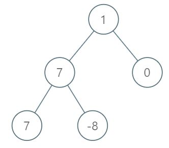

# [1161. Maximum Level Sum of a Binary Tree](https://leetcode.com/problems/maximum-level-sum-of-a-binary-tree/)

## Problem

Given the `root` of a binary tree, the level of its root is `1`, the level of its children is `2`, and so on.

Return the smallest level `x` such that the sum of all the values of nodes at level `x` is maximal.

Example 1:



```
Input: root = [1,7,0,7,-8,null,null]
Output: 2
Explanation: 
Level 1 sum = 1.
Level 2 sum = 7 + 0 = 7.
Level 3 sum = 7 + -8 = -1.
So we return the level with the maximum sum which is level 2.
```

Example 2:

```
Input: root = [989,null,10250,98693,-89388,null,null,null,-32127]
Output: 2
```

Constraints:

- The number of nodes in the tree is in the range `[1, 10^4]`.
- `-10^5 <= Node.val <= 10^5`

## Solution

```go
/**
 * Definition for a binary tree node.
 * type TreeNode struct {
 *     Val int
 *     Left *TreeNode
 *     Right *TreeNode
 * }
 */
func maxLevelSum(root *TreeNode) int {
    queue := []*TreeNode{root}

    maxSum := -math.MaxInt
    maxSumLevel := 0
    level := 0
    for len(queue) > 0 {
        level++
        size := len(queue)
        currSum := 0
        for i:=0; i<size; i++ {
            curr := queue[0]
            currSum += curr.Val
            queue = queue[1:]
            if curr.Left != nil {
                queue = append(queue, curr.Left)
            }
            if curr.Right != nil {
                queue = append(queue, curr.Right)
            }
        }
        if currSum > maxSum {
            maxSum = currSum
            maxSumLevel = level
        }
    }

    return maxSumLevel
}
```