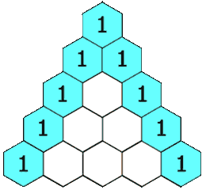

# [118. Pascal's Triangle](https://leetcode.com/problems/pascals-triangle/)

## Problem

Given an integer `numRows`, return the first numRows of Pascal's triangle.

In Pascal's triangle, each number is the sum of the two numbers directly above it as shown:



 
Example 1:

```
Input: numRows = 5
Output: [[1],[1,1],[1,2,1],[1,3,3,1],[1,4,6,4,1]]
```

Example 2:

```
Input: numRows = 1
Output: [[1]]
``` 

Constraints:

- `1 <= numRows <= 30`


## Solution

```go
func generate(numRows int) [][]int {
	dp := make([][]int, numRows)
	dp[0] = []int{1}
	if numRows == 1 {
		return dp
	}
	dp[1] = []int{1, 1}
	if numRows == 2 {
		return dp
	}

	for i := 2; i < numRows; i++ {
		dp[i] = make([]int, i+1)
		dp[i][0] = 1
		dp[i][i] = 1
		for j := 1; j < i; j++ {
			dp[i][j] = dp[i-1][j-1] + dp[i-1][j]
		}
	}
	return dp
}
```