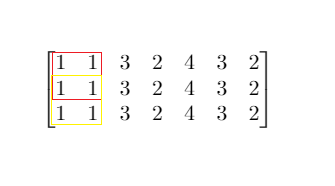

# [1292. Maximum Side Length of a Square with Sum Less than or Equal to Threshold](https://leetcode.com/problems/maximum-side-length-of-a-square-with-sum-less-than-or-equal-to-threshold/)

## Problem

Given a `m x n` matrix `mat` and an integer `threshold`, return the maximum side-length of a square with a sum less than or equal to `threshold` or return `0` if there is no such square.

Example 1:



```
Input: mat = [[1,1,3,2,4,3,2],[1,1,3,2,4,3,2],[1,1,3,2,4,3,2]], threshold = 4
Output: 2
Explanation: The maximum side length of square with sum less than 4 is 2 as shown.
```

Example 2:

```
Input: mat = [[2,2,2,2,2],[2,2,2,2,2],[2,2,2,2,2],[2,2,2,2,2],[2,2,2,2,2]], threshold = 1
Output: 0
```

Constraints:

- `m == mat.length`
- `n == mat[i].length`
- `1 <= m, n <= 300`
- `0 <= mat[i][j] <= 10^4`
- `0 <= threshold <= 10^5`

## Solution

```go
func maxSideLength(mat [][]int, threshold int) int {
	m := len(mat)
	n := len(mat[0])

	prefixSum := make([][]int, m+1)
	for i := range prefixSum {
		prefixSum[i] = make([]int, n+1)
	}
	for i := 1; i < m+1; i++ {
		for j := 1; j < n+1; j++ {
			prefixSum[i][j] = prefixSum[i-1][j] + prefixSum[i][j-1] - prefixSum[i-1][j-1] + mat[i-1][j-1]
		}
	}

	left, right := 0, min(m, n)
	result := 0

	for left <= right {
		mid := left + (right-left)/2
		if isValid(prefixSum, threshold, mid) {
			result = mid
			left = mid + 1
		} else {
			right = mid - 1
		}
	}

	return result
}

func isValid(prefixSum [][]int, threshold int, length int) bool {
	for i := length; i < len(prefixSum); i++ {
		for j := length; j < len(prefixSum[0]); j++ {
			sum := prefixSum[i][j] - prefixSum[i-length][j] - prefixSum[i][j-length] + prefixSum[i-length][j-length]
			if sum <= threshold {
				return true
			}
		}
	}
	return false
}
```