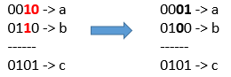

# [1318. Minimum Flips to Make a OR b Equal to c](https://leetcode.com/problems/minimum-flips-to-make-a-or-b-equal-to-c/)

## Problem

Given 3 positives numbers `a`, `b` and `c`. Return the minimum flips required in some bits of `a` and `b` to make ( `a` OR `b` == `c` ). (bitwise OR operation).
Flip operation consists of change any single bit 1 to 0 or change the bit 0 to 1 in their binary representation.

 

Example 1:



```
Input: a = 2, b = 6, c = 5
Output: 3
Explanation: After flips a = 1 , b = 4 , c = 5 such that (a OR b == c)
```

Example 2:

```
Input: a = 4, b = 2, c = 7
Output: 1
```

Example 3:

```
Input: a = 1, b = 2, c = 3
Output: 0
``` 

Constraints:

- `1 <= a <= 10^9`
- `1 <= b <= 10^9`
- `1 <= c <= 10^9`

## Solution

```go
func minFlips(a int, b int, c int) int {
	flips := 0
	for a != 0 || b != 0 || c != 0 {
		lastA := a & 1
		lastB := b & 1
		lastC := c & 1
		if lastC != (lastA | lastB) {
			if lastC == 0 {
				if lastA == 1 {
					flips++
				}
				if lastB == 1 {
					flips++
				}
			} else if lastC == 1 {
				flips++
			}
		}
		c >>= 1
		b >>= 1
		a >>= 1
	}
	return flips
}
```