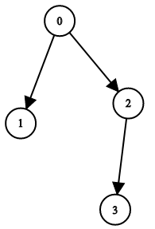
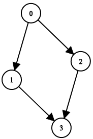
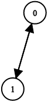

# [1361. Validate Binary Tree Nodes](https://leetcode.com/problems/validate-binary-tree-nodes/)

## Problem

You have n binary tree nodes numbered from `0` to `n - 1` where node `i` has two children `leftChild[i]` and `rightChild[i]`, return `true` if and only if all the given nodes form exactly one valid binary tree.

If node `i` has no left child then `leftChild[i]` will equal `-1`, similarly for the right child.

Note that the nodes have no values and that we only use the node numbers in this problem.


Example 1:



```
Input: n = 4, leftChild = [1,-1,3,-1], rightChild = [2,-1,-1,-1]
Output: true
```

Example 2:



```
Input: n = 4, leftChild = [1,-1,3,-1], rightChild = [2,3,-1,-1]
Output: false
```

Example 3:



```
Input: n = 2, leftChild = [1,0], rightChild = [-1,-1]
Output: false
```

Constraints:

- `n == leftChild.length == rightChild.length`
- `1 <= n <= 10^4`
- `-1 <= leftChild[i], rightChild[i] <= n - 1`

## Solution

```go
func validateBinaryTreeNodes(n int, leftChild []int, rightChild []int) bool {
	parent := make([]int, n)
	for i := range parent {
		parent[i] = -1
	}

	for i := 0; i < n; i++ {
		if leftChild[i] != -1 {
			if parent[leftChild[i]] != -1 {
				return false
			}
			parent[leftChild[i]] = i
		}
		if rightChild[i] != -1 {
			if parent[rightChild[i]] != -1 {
				return false
			}
			parent[rightChild[i]] = i
		}
	}

	root := -1
	for i := 0; i < n; i++ {
		if parent[i] == -1 {
			if root != -1 {
				return false
			}
			root = i
		}
	}

	if root == -1 {
		return false
	}

	visited := make([]bool, n)
	var dfs func(node int)
	dfs = func(node int) {
		if node == -1 || visited[node] {
			return
		}
		visited[node] = true
		dfs(leftChild[node])
		dfs(rightChild[node])
	}

	dfs(root)

	for _, v := range visited {
		if !v {
			return false
		}
	}

	return true
}
```