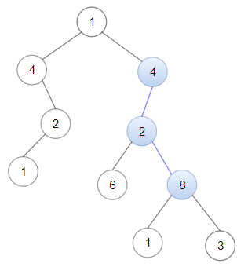
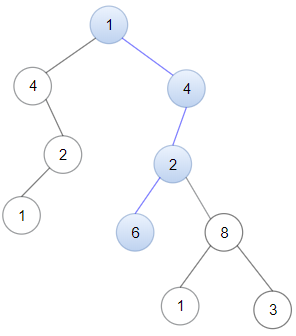

# [1367. Linked List in Binary Tree](https://leetcode.com/problems/linked-list-in-binary-tree/)

## Problem

Given a binary tree `root` and a linked list with `head` as the first node. 

Return True if all the elements in the linked list starting from the `head` correspond to some downward path connected in the binary tree otherwise return False.

In this context downward path means a path that starts at some node and goes downwards.


Example 1:



```
Input: head = [4,2,8], root = [1,4,4,null,2,2,null,1,null,6,8,null,null,null,null,1,3]
Output: true
Explanation: Nodes in blue form a subpath in the binary Tree.  
```

Example 2:



```
Input: head = [1,4,2,6], root = [1,4,4,null,2,2,null,1,null,6,8,null,null,null,null,1,3]
Output: true
```

Example 3:

```
Input: head = [1,4,2,6,8], root = [1,4,4,null,2,2,null,1,null,6,8,null,null,null,null,1,3]
Output: false
Explanation: There is no path in the binary tree that contains all the elements of the linked list from head.
``` 

Constraints:

- The number of nodes in the tree will be in the range `[1, 2500]`.
- The number of nodes in the list will be in the range `[1, 100]`.
- `1 <= Node.val <= 100` for each node in the linked list and binary tree.

## Solution

```go
func isSubPath(head *ListNode, root *TreeNode) bool {
	nums := []int{}
	for head != nil {
		nums = append(nums, head.Val)
		head = head.Next
	}
	n := len(nums)

	var dfs func(node *TreeNode, index int) bool
	dfs = func(node *TreeNode, index int) bool {
		if index == n {
			return true
		}
		if node == nil {
			return false
		}
		if node.Val == nums[index] {
			return dfs(node.Left, index+1) || dfs(node.Right, index+1)
		}
		return false
	}

	var traverse func(node *TreeNode) bool
	traverse = func(node *TreeNode) bool {
		if node == nil {
			return false
		}
		if dfs(node, 0) {
			return true
		}
		return traverse(node.Left) || traverse(node.Right)
	}

	return traverse(root)
}
```