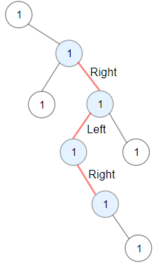

# [1372. Longest ZigZag Path in a Binary Tree](https://leetcode.com/problems/longest-zigzag-path-in-a-binary-tree/)

## Problem

You are given the `root` of a binary tree.

A ZigZag path for a binary tree is defined as follow:

- Choose any node in the binary tree and a direction (right or left).
- If the current direction is right, move to the right child of the current node; otherwise, move to the left child.
- Change the direction from right to left or from left to right.
- Repeat the second and third steps until you can't move in the tree.

Zigzag length is defined as the number of nodes visited - 1. (A single node has a length of 0).

Return the longest ZigZag path contained in that tree.

Example 1:



```
Input: root = [1,null,1,1,1,null,null,1,1,null,1,null,null,null,1]
Output: 3
Explanation: Longest ZigZag path in blue nodes (right -> left -> right).
```

Example 2:


```
Input: root = [1,1,1,null,1,null,null,1,1,null,1]
Output: 4
Explanation: Longest ZigZag path in blue nodes (left -> right -> left -> right).
```

Example 3:

```
Input: root = [1]
Output: 0
```

Constraints:

- The number of nodes in the tree is in the range `[1, 5 * 10^4]`.
- `1 <= Node.val <= 100`

## Solution

```go
/**
 * Definition for a binary tree node.
 * type TreeNode struct {
 *     Val int
 *     Left *TreeNode
 *     Right *TreeNode
 * }
 */
func longestZigZag(root *TreeNode) int {
    leftCount := dfs(root.Left, true, 0)
    rightCount := dfs(root.Right, false, 0)
    return max(leftCount, rightCount)
}

func dfs(node *TreeNode, isLeft bool, count int) int {
	if node == nil {
		return count
	}

	if isLeft {
        leftCount := dfs(node.Left, true, 0)
        rightCount := dfs(node.Right, false, count+1)
        return max(leftCount, rightCount)
	}
    leftCount := dfs(node.Left, true, count+1)
    rightCount := dfs(node.Right, false, 0)
    return max(leftCount, rightCount)
}

func max(a, b int) int {
	if a > b {
		return a
	}
	return b
}
```