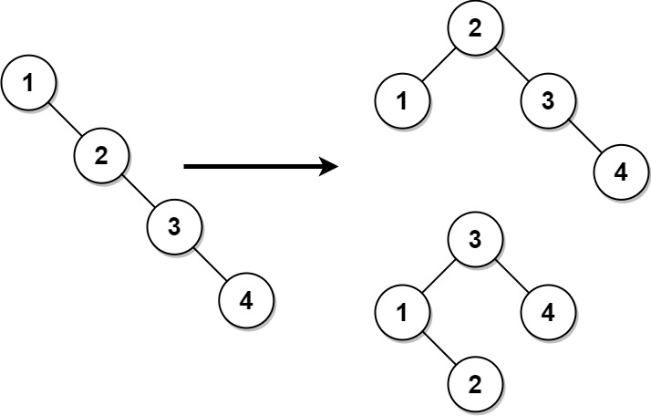
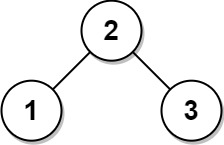

# [1382. Balance a Binary Search Tree](https://leetcode.com/problems/balance-a-binary-search-tree/)

## Problem

Given the `root` of a binary search tree, return a **balanced** binary search tree with the same node values. If there is more than one answer, return any of them.

A binary search tree is balanced if the depth of the two subtrees of every node never differs by more than `1`.


Example 1:



```
Input: root = [1,null,2,null,3,null,4,null,null]
Output: [2,1,3,null,null,null,4]
Explanation: This is not the only correct answer, [3,1,4,null,2] is also correct.
```

Example 2:



```
Input: root = [2,1,3]
Output: [2,1,3]
```

Constraints:

- The number of nodes in the tree is in the range `[1, 10^4]`.
- `1 <= Node.val <= 10^5`

## Solution

```go
func balanceBST(root *TreeNode) *TreeNode {
	var sortedArr []*TreeNode

	var inorder func(*TreeNode)
	inorder = func(node *TreeNode) {
		if node == nil {
			return
		}
		inorder(node.Left)
		sortedArr = append(sortedArr, node)
		inorder(node.Right)
	}

	var sortedArrToBST func(start, end int) *TreeNode
	sortedArrToBST = func(start, end int) *TreeNode {
		if start > end {
			return nil
		}
		mid := (start + end) / 2
		root := sortedArr[mid]
		root.Left = sortedArrToBST(start, mid-1)
		root.Right = sortedArrToBST(mid+1, end)
		return root
	}

	inorder(root)
	return sortedArrToBST(0, len(sortedArr)-1)
}
```