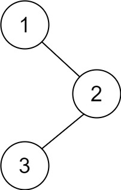

# [145. Binary Tree Postorder Traversal](https://leetcode.com/problems/binary-tree-postorder-traversal/)

## Problem

Given the `root` of a binary tree, return the postorder traversal of its nodes' values.


Example 1:



```
Input: root = [1,null,2,3]
Output: [3,2,1]
```

Example 2:

```
Input: root = []
Output: []
```

Example 3:

```
Input: root = [1]
Output: [1]
```


Constraints:

- The number of the nodes in the tree is in the range `[0, 100]`.
- `-100 <= Node.val <= 100`

## Solution

```go
func postorderTraversal(root *TreeNode) []int {
	if root == nil {
		return []int{}
	}

	path := []int{}
	helper(root, &path)
	return path
}

func helper(node *TreeNode, path *[]int) {
	if node == nil {
		return
	}

	helper(node.Left, path)
	helper(node.Right, path)
	*path = append(*path, node.Val)
}
```