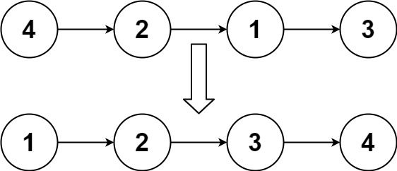
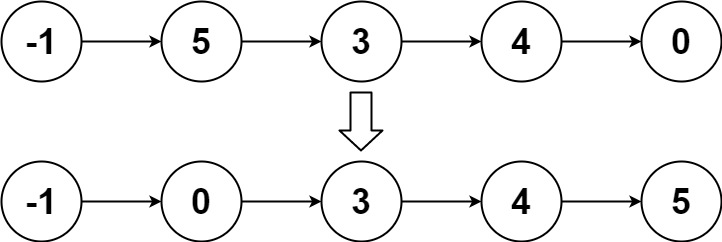

# [148. Sort List](https://leetcode.com/problems/sort-list/)

## Problem

Given the `head` of a linked list, return the list after sorting it in **ascending order**.


Example 1:



```
Input: head = [4,2,1,3]
Output: [1,2,3,4]
```

Example 2:



```
Input: head = [-1,5,3,4,0]
Output: [-1,0,3,4,5]
```

Example 3:

```
Input: head = []
Output: []
``` 

Constraints:

- The number of nodes in the list is in the range `[0, 5 * 10^4]`.
- `-10^5 <= Node.val <= 10^5`

## Solution

```go
func sortList(head *ListNode) *ListNode {
	if head == nil || head.Next == nil {
		return head
	}

	mid := getMiddle(head)
	next := mid.Next
	mid.Next = nil

	left := sortList(head)
	right := sortList(next)
	return merge(left, right)
}

func getMiddle(node *ListNode) *ListNode {
	if node == nil {
		return node
	}

	slow, fast := node, node
	for fast.Next != nil && fast.Next.Next != nil {
		slow = slow.Next
		fast = fast.Next.Next
	}
	return slow
}

func merge(l1 *ListNode, l2 *ListNode) *ListNode {
	dummy := &ListNode{}
	curr := dummy

	for l1 != nil && l2 != nil {
		if l1.Val < l2.Val {
			curr.Next = l1
			l1 = l1.Next
		} else {
			curr.Next = l2
			l2 = l2.Next
		}
		curr = curr.Next
	}

	if l1 != nil {
		curr.Next = l1
	}

	if l2 != nil {
		curr.Next = l2
	}

	return dummy.Next
}
```