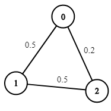
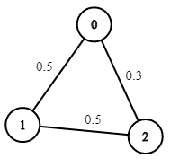
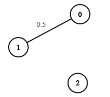

# [1514. Path with Maximum Probability](https://leetcode.com/problems/path-with-maximum-probability/)

## Problem

You are given an undirected weighted graph of `n` nodes (0-indexed), represented by an edge list where `edges[i] = [a, b]` is an undirected edge connecting the nodes `a` and `b` with a probability of success of traversing that edge `succProb[i]`.

Given two nodes `start` and `end`, find the path with the maximum probability of success to go from `start` to `end` and return its success probability.

If there is no path from `start` to `end`, **return 0**. Your answer will be accepted if it differs from the correct answer by at most **1e-5**.


Example 1:



```
Input: n = 3, edges = [[0,1],[1,2],[0,2]], succProb = [0.5,0.5,0.2], start = 0, end = 2
Output: 0.25000
Explanation: There are two paths from start to end, one having a probability of success = 0.2 and the other has 0.5 * 0.5 = 0.25.
```

Example 2:



```
Input: n = 3, edges = [[0,1],[1,2],[0,2]], succProb = [0.5,0.5,0.3], start = 0, end = 2
Output: 0.30000
```

Example 3:



```
Input: n = 3, edges = [[0,1]], succProb = [0.5], start = 0, end = 2
Output: 0.00000
Explanation: There is no path between 0 and 2.
``` 

Constraints:

- `2 <= n <= 10^4`
- `0 <= start, end < n`
- `start != end`
- `0 <= a, b < n`
- `a != b`
- `0 <= succProb.length == edges.length <= 2*10^4`
- `0 <= succProb[i] <= 1`
- There is at most one edge between every two nodes.

## Solution

```go
func maxProbability(n int, edges [][]int, succProb []float64, startNode int, endNode int) float64 {
	type neighborInfo struct {
		neighbor    int
		probability float64
	}

	graph := make(map[int][]neighborInfo)
	for i, edge := range edges {
		from, to := edge[0], edge[1]
		graph[from] = append(graph[from], neighborInfo{to, succProb[i]})
		graph[to] = append(graph[to], neighborInfo{from, succProb[i]})
	}

	maxProbabilities := make([]float64, n)
	maxProbabilities[startNode] = 1.0

	for i := 0; i < n-1; i++ {
		hasUpdate := false

		for currNode, neighbors := range graph {
			for _, neighborInfo := range neighbors {
				neighborNode := neighborInfo.neighbor
				edgeProbability := neighborInfo.probability

				if maxProbabilities[currNode]*edgeProbability > maxProbabilities[neighborNode] {
					maxProbabilities[neighborNode] = maxProbabilities[currNode] * edgeProbability
					hasUpdate = true
				}
			}
		}

		if !hasUpdate {
			break
		}
	}

	return maxProbabilities[endNode]
}
```