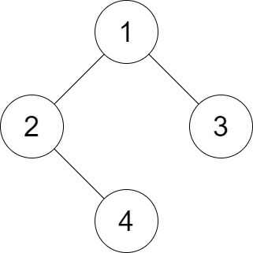
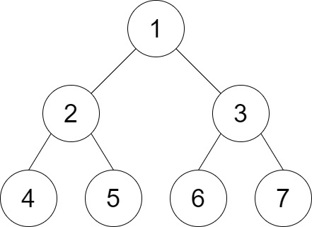

# [1530. Number of Good Leaf Nodes Pairs](https://leetcode.com/problems/number-of-good-leaf-nodes-pairs/)

## Problem

You are given the `root` of a binary tree and an integer `distance`. A pair of two different **leaf** nodes of a binary tree is said to be good if the length of **the shortest path** between them is less than or equal to `distance`.

Return the number of good leaf node pairs in the tree.


Example 1:



```
Input: root = [1,2,3,null,4], distance = 3
Output: 1
Explanation: The leaf nodes of the tree are 3 and 4 and the length of the shortest path between them is 3. This is the only good pair.
```

Example 2:



```
Input: root = [1,2,3,4,5,6,7], distance = 3
Output: 2
Explanation: The good pairs are [4,5] and [6,7] with shortest path = 2. The pair [4,6] is not good because the length of ther shortest path between them is 4.
```

Example 3:

```
Input: root = [7,1,4,6,null,5,3,null,null,null,null,null,2], distance = 3
Output: 1
Explanation: The only good pair is [2,5].
```

Constraints:

- The number of nodes in the `tree` is in the range `[1, 2^10]`.
- `1 <= Node.val <= 100`
- `1 <= distance <= 10`

## Solution

```go
func countPairs(root *TreeNode, distance int) int {
	goodPairCount := 0

	var dfs func(node *TreeNode) []int
	dfs = func(node *TreeNode) []int {
		if node == nil {
			return []int{}
		}

		if node.Left == nil && node.Right == nil {
			return []int{0}
		}

		leftLeafDistances := dfs(node.Left)
		rightLeafDistances := dfs(node.Right)

		for _, leftDist := range leftLeafDistances {
			for _, rightDist := range rightLeafDistances {
				if leftDist+rightDist+2 <= distance {
					goodPairCount++
				}
			}
		}

		currNodeDistances := []int{}
		for _, dist := range leftLeafDistances {
			newDist := dist + 1
			if newDist < distance {
				currNodeDistances = append(currNodeDistances, newDist)
			}
		}

		for _, dist := range rightLeafDistances {
			newDist := dist + 1
			if newDist < distance {
				currNodeDistances = append(currNodeDistances, newDist)
			}
		}

		return currNodeDistances
	}

	dfs(root)
	return goodPairCount
}
```