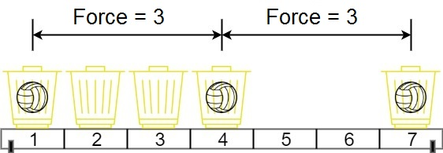

# [1552. Magnetic Force Between Two Balls](https://leetcode.com/problems/magnetic-force-between-two-balls/)

## Problem

In the universe Earth C-137, Rick discovered a special form of magnetic force between two balls if they are put in his new invented basket. Rick has `n` empty baskets, the `ith` basket is at `position[i]`, Morty has `m` balls and needs to distribute the balls into the baskets such that the minimum magnetic force between any two balls is maximum.

Rick stated that magnetic force between two different balls at positions `x` and `y` is `|x - y|`.

Given the integer array `position` and the integer `m`. Return the required force.

 

Example 1:



```
Input: position = [1,2,3,4,7], m = 3
Output: 3
Explanation: Distributing the 3 balls into baskets 1, 4 and 7 will make the magnetic force between ball pairs [3, 3, 6]. The minimum magnetic force is 3. We cannot achieve a larger minimum magnetic force than 3.
```

Example 2:

```
Input: position = [5,4,3,2,1,1000000000], m = 2
Output: 999999999
Explanation: We can use baskets 1 and 1000000000.
```

Constraints:

- `n == position.length`
- `2 <= n <= 10^5`
- `1 <= position[i] <= 10^9`
- All integers in `position` are distinct.
- `2 <= m <= position.length`

## Solution

```go
func maxDistance(position []int, m int) int {
	sort.Ints(position)

    // left: 최소 자기력의 하한값 1로 초기화
    // right: 최소 자기력의 상한값인 가장 오른쪽 바구니와 가장 왼쪽 바구니의 거리로 초기화
	left, right := 1, position[len(position)-1]-position[0]
	result := -1
	for left <= right {
		mid := (left + right) / 2   // 현재 탐색할 최소 자기력

        // 현재 mid 값으로 공을 분배하기 위한 변수 초기화
        // lastPosition: 마지막으로 공을 넣은 바구니의 위치 저장
        // balls: 현재까지 넣은 공의 개수 저장
		lastPosition, balls := position[0], 1

        // 바구니의 위치를 순회하며 공을 분배
		for i := 1; i < len(position); i++ {
            // 현재 바구니와 마지막으로 공을 넣은 바구니의 거리가 mid 이상인 경우에만 공을 넣는다
			if position[i]-lastPosition >= mid {
				lastPosition = position[i]
				balls++
			}
		}

        // 분배한 공의 개수가 m 이상인 경우, 최소 자기력을 증가시킨다
		if balls >= m {
			result = mid
			left = mid + 1
		} else {
            // 분배한 공의 개수가 m 미만인 경우, 최소 자기력을 감소시킨다
			right = mid - 1
		}
	}
	return result
}
```