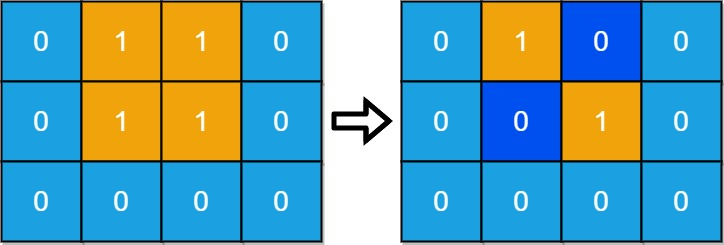
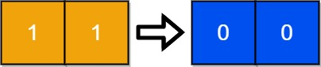

# [1568. Minimum Number of Days to Disconnect Island](https://leetcode.com/problems/minimum-number-of-days-to-disconnect-island/)

## Problem

You are given an `m x n` binary grid `grid` where `1` represents land and `0` represents water. An **island** is a maximal **4-directionally** (horizontal or vertical) connected group of `1`'s.

The grid is said to be **connected** if we have **exactly one island**, otherwise is said **disconnected**.

In one day, we are allowed to change any single land cell `(1)` into a water cell `(0)`.

Return the minimum number of days to disconnect the grid.


Example 1:



```
Input: grid = [[0,1,1,0],[0,1,1,0],[0,0,0,0]]

Output: 2
Explanation: We need at least 2 days to get a disconnected grid.
Change land grid[1][1] and grid[0][2] to water and get 2 disconnected island.
```

Example 2:



```
Input: grid = [[1,1]]
Output: 2
Explanation: Grid of full water is also disconnected ([[1,1]] -> [[0,0]]), 0 islands.
``` 

Constraints:

- `m == grid.length`
- `n == grid[i].length`
- `1 <= m, n <= 30`
- `grid[i][j]` is either `0` or `1`.

## Solution

```go
func minDays(grid [][]int) int {
	m, n := len(grid), len(grid[0])

	if isDisconnected(grid) {
		return 0
	}

	for days := 1; days <= m*n; days++ {
		if canDisconnect(grid, days) {
			return days
		}
	}

	return m * n
}

func canDisconnect(grid [][]int, days int) bool {
	m, n := len(grid), len(grid[0])
	cells := make([][2]int, 0, m*n)

	for i := 0; i < m; i++ {
		for j := 0; j < n; j++ {
			if grid[i][j] == 1 {
				cells = append(cells, [2]int{i, j})
			}
		}
	}

	return tryRemoveCells(grid, cells, 0, days, make([][2]int, 0, days))
}

func tryRemoveCells(grid [][]int, cells [][2]int, start, days int, removed [][2]int) bool {
	if len(removed) == days {
		copyGrid := copyGrid(grid)
		for _, cell := range removed {
			copyGrid[cell[0]][cell[1]] = 0
		}
		return isDisconnected(copyGrid)
	}

	for i := start; i < len(cells); i++ {
		removed = append(removed, cells[i])
		if tryRemoveCells(grid, cells, i+1, days, removed) {
			return true
		}
		removed = removed[:len(removed)-1]
	}

	return false
}

func dfs(grid [][]int, i, j int, visited [][]bool) {
	if i < 0 || i >= len(grid) || j < 0 || j >= len(grid[0]) || visited[i][j] || grid[i][j] == 0 {
		return
	}

	visited[i][j] = true

	dfs(grid, i+1, j, visited)
	dfs(grid, i-1, j, visited)
	dfs(grid, i, j+1, visited)
	dfs(grid, i, j-1, visited)
}

func countIslands(grid [][]int) int {
	visited := make([][]bool, len(grid))
	for i := range visited {
		visited[i] = make([]bool, len(grid[0]))
	}

	islands := 0
	for i := 0; i < len(grid); i++ {
		for j := 0; j < len(grid[0]); j++ {
			if grid[i][j] == 1 && !visited[i][j] {
				dfs(grid, i, j, visited)
				islands++
			}
		}
	}
	return islands
}

func isDisconnected(grid [][]int) bool {
	island := countIslands(grid)
	return island != 1
}

func copyGrid(grid [][]int) [][]int {
	copied := make([][]int, len(grid))
	for i := range grid {
		copied[i] = make([]int, len(grid[i]))
		copy(copied[i], grid[i])
	}
	return copied
}
```