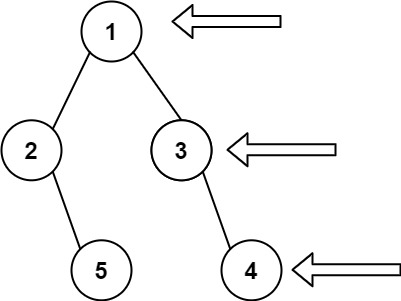

# [199. Binary Tree Right Side View](https://leetcode.com/problems/binary-tree-right-side-view/)

## Problem

Given the `root` of a binary tree, imagine yourself standing on the right side of it, return the values of the nodes you can see ordered from top to bottom.

Example 1:



```
Input: root = [1,2,3,null,5,null,4]
Output: [1,3,4]
```

Example 2:

```
Input: root = [1,null,3]
Output: [1,3]
```

Example 3:

```
Input: root = []
Output: []
```

Constraints:

- The number of nodes in the tree is in the range `[0, 100]`.
- `-100 <= Node.val <= 100`

## Solution

```go
/**
 * Definition for a binary tree node.
 * type TreeNode struct {
 *     Val int
 *     Left *TreeNode
 *     Right *TreeNode
 * }
 */
func rightSideView(root *TreeNode) []int {
    if root == nil {
        return []int{}
    }
    
    queue := []*TreeNode{root}
    result := []int{}

    for len(queue) != 0 {
        size := len(queue)

        var prev *TreeNode

        for i:=0; i<size; i++ {
            current := queue[0]
            queue = queue[1:]

            if current.Left != nil {
                queue = append(queue, current.Left)
            }
            if current.Right != nil {
                queue = append(queue, current.Right)
            }

            prev = current
        }

        result = append(result, prev.Val)
    }

    return result
}
```