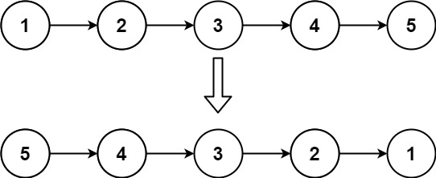

# [206. Reverse Linked List](https://leetcode.com/problems/reverse-linked-list/)

## Problem

Given the `head` of a singly linked list, reverse the list, and return the reversed list.

Example 1:



```
Input: head = [1,2,3,4,5]
Output: [5,4,3,2,1]
```

Example 2:


```
Input: head = [1,2]
Output: [2,1]
```

Example 3:

```
Input: head = []
Output: []
``` 

Constraints:

- The number of nodes in the list is the range `[0, 5000]`.
- `-5000 <= Node.val <= 5000`

Follow up: A linked list can be reversed either iteratively or recursively. Could you implement both?

## Solution

### Iteratively

```go
/**
 * Definition for singly-linked list.
 * type ListNode struct {
 *     Val int
 *     Next *ListNode
 * }
 */
func reverseList(head *ListNode) *ListNode {
    var prev *ListNode
    curr := head
    for curr != nil {
        next := curr.Next
        curr.Next = prev
        prev = curr
        curr = next
    }
    return prev
}
```

### Recursively

```go
/**
 * Definition for singly-linked list.
 * type ListNode struct {
 *     Val int
 *     Next *ListNode
 * }
 */
func reverseList(head *ListNode) *ListNode {
    if head == nil || head.Next == nil {
        return head
    }

    newHead := reverseList(head.Next)
    head.Next.Next = head
    head.Next = nil
    return newHead
}
```