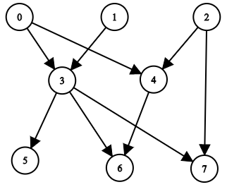

# [2192. All Ancestors of a Node in a Directed Acyclic Graph](https://leetcode.com/problems/all-ancestors-of-a-node-in-a-directed-acyclic-graph/)

## Problem

You are given a positive integer `n` representing the number of nodes of a **Directed Acyclic Graph** (DAG). The nodes are numbered from `0` to `n - 1` (**inclusive**).

You are also given a 2D integer array `edges`, where `edges[i] = [from_i, to_i]` denotes that there is a **unidirectional** edge from `from_i` to `to_i` in the graph.

Return a list `answer`, where `answer[i]` is the list of ancestors of the `ith` node, *sorted in ascending order*.

A node `u` is an ancestor of another node `v` if `u` can reach `v` via a set of edges.


Example 1:



```
Input: n = 8, edgeList = [[0,3],[0,4],[1,3],[2,4],[2,7],[3,5],[3,6],[3,7],[4,6]]
Output: [[],[],[],[0,1],[0,2],[0,1,3],[0,1,2,3,4],[0,1,2,3]]
Explanation:
The above diagram represents the input graph.
- Nodes 0, 1, and 2 do not have any ancestors.
- Node 3 has two ancestors 0 and 1.
- Node 4 has two ancestors 0 and 2.
- Node 5 has three ancestors 0, 1, and 3.
- Node 6 has five ancestors 0, 1, 2, 3, and 4.
- Node 7 has four ancestors 0, 1, 2, and 3.
```

Example 2:


```
Input: n = 5, edgeList = [[0,1],[0,2],[0,3],[0,4],[1,2],[1,3],[1,4],[2,3],[2,4],[3,4]]
Output: [[],[0],[0,1],[0,1,2],[0,1,2,3]]
Explanation:
The above diagram represents the input graph.
- Node 0 does not have any ancestor.
- Node 1 has one ancestor 0.
- Node 2 has two ancestors 0 and 1.
- Node 3 has three ancestors 0, 1, and 2.
- Node 4 has four ancestors 0, 1, 2, and 3.
```

Constraints:

- `1 <= n <= 1000`
- `0 <= edges.length <= min(2000, n * (n - 1) / 2)`
- `edges[i].length == 2`
- `0 <= from_i, to_i <= n - 1`
- `from_i != to_i`
- There are no duplicate edges.
- The graph is **directed** and **acyclic**.

## Solution

```go
func getAncestors(n int, edges [][]int) [][]int {
	result := make([][]int, n)
	child := make(map[int][]int)

	for _, edge := range edges {
		from, to := edge[0], edge[1]
		child[from] = append(child[from], to)
	}

	var dfs func(ancestor, curr int)
	dfs = func(ancestor, curr int) {
		for _, ch := range child[curr] {
			if !contains(result[ch], ancestor) {
				result[ch] = append(result[ch], ancestor)
				dfs(ancestor, ch)
			}
		}
	}

	for i := 0; i < n; i++ {
		dfs(i, i)
	}

	return result
}

func contains(arr []int, num int) bool {
	for _, n := range arr {
		if n == num {
			return true
		}
	}
	return false
}
```