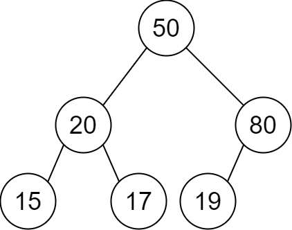
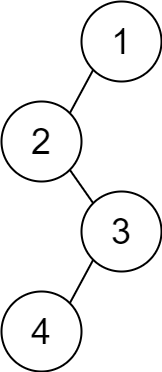

# [2196. Create Binary Tree From Descriptions](https://leetcode.com/problems/create-binary-tree-from-descriptions/)

## Problem

You are given a 2D integer array `descriptions` where `descriptions[i] = [parenti, childi, isLefti]` indicates that `parenti` is the parent of `childi` in a binary tree of unique values. Furthermore,

- If `isLefti == 1`, then `childi` is the left child of `parenti`.
- If `isLefti == 0`, then `childi` is the right child of `parenti`.

Construct the binary tree described by `descriptions` and return its root.

The test cases will be generated such that the binary tree is valid.


Example 1:



```
Input: descriptions = [[20,15,1],[20,17,0],[50,20,1],[50,80,0],[80,19,1]]
Output: [50,20,80,15,17,19]
Explanation: The root node is the node with value 50 since it has no parent.
The resulting binary tree is shown in the diagram.
```

Example 2:



```
Input: descriptions = [[1,2,1],[2,3,0],[3,4,1]]
Output: [1,2,null,null,3,4]
Explanation: The root node is the node with value 1 since it has no parent.
The resulting binary tree is shown in the diagram.
``` 

Constraints:

- `1 <= descriptions.length <= 10^4`
descriptions[i].length == 3
1 <= parenti, childi <= 105
0 <= isLefti <= 1
The binary tree described by descriptions is valid.

## Solution

```go
func createBinaryTree(descriptions [][]int) *TreeNode {
	nodeMap := make(map[int]*TreeNode)
	childSet := make(map[int]bool)

	for _, d := range descriptions {
		parent, child, left := d[0], d[1], d[2]

		if _, exist := nodeMap[parent]; !exist {
			nodeMap[parent] = &TreeNode{Val: parent}
		}
		if _, childExist := nodeMap[child]; !childExist {
			nodeMap[child] = &TreeNode{Val: child}
		}

		parentNode := nodeMap[parent]
		childNode := nodeMap[child]

		if left == 1 {
			parentNode.Left = childNode
		} else {
			parentNode.Right = childNode
		}

		childSet[child] = true
	}

	var head *TreeNode
	for val, node := range nodeMap {
		if !childSet[val] {
			head = node
			break
		}
	}
	return head
}
```