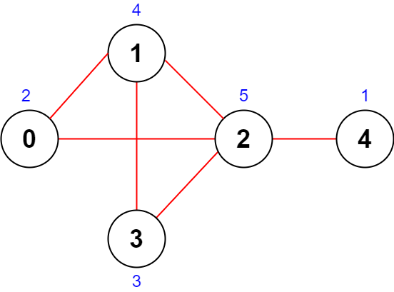
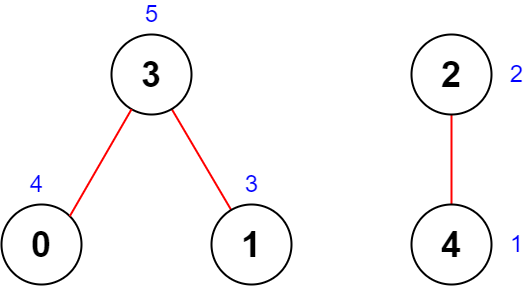

# [2285. Maximum Total Importance of Roads](https://leetcode.com/problems/maximum-total-importance-of-roads/)

## Problem

You are given an integer `n` denoting the number of cities in a country. The cities are numbered from `0` to `n - 1`.

You are also given a 2D integer array `roads` where `roads[i] = [ai, bi]` denotes that there exists a bidirectional road connecting cities `ai` and `bi`.

You need to assign each city with an integer value from `1` to `n`, where each value can only be used once. The **importance** of a road is then defined as the sum of the values of the two cities it connects.

Return the **maximum total importance** of all roads possible after assigning the values optimally.


Example 1:



```
Input: n = 5, roads = [[0,1],[1,2],[2,3],[0,2],[1,3],[2,4]]
Output: 43
Explanation: The figure above shows the country and the assigned values of [2,4,5,3,1].
- The road (0,1) has an importance of 2 + 4 = 6.
- The road (1,2) has an importance of 4 + 5 = 9.
- The road (2,3) has an importance of 5 + 3 = 8.
- The road (0,2) has an importance of 2 + 5 = 7.
- The road (1,3) has an importance of 4 + 3 = 7.
- The road (2,4) has an importance of 5 + 1 = 6.
The total importance of all roads is 6 + 9 + 8 + 7 + 7 + 6 = 43.
It can be shown that we cannot obtain a greater total importance than 43.
```

Example 2:



```
Input: n = 5, roads = [[0,3],[2,4],[1,3]]
Output: 20
Explanation: The figure above shows the country and the assigned values of [4,3,2,5,1].
- The road (0,3) has an importance of 4 + 5 = 9.
- The road (2,4) has an importance of 2 + 1 = 3.
- The road (1,3) has an importance of 3 + 5 = 8.
The total importance of all roads is 9 + 3 + 8 = 20.
It can be shown that we cannot obtain a greater total importance than 20.
```

Constraints:

- `2 <= n <= 5 * 10^4`
- `1 <= roads.length <= 5 * 10^4`
- `roads[i].length == 2`
- `0 <= ai, bi <= n - 1`
- `ai != bi`
- There are no duplicate roads.

## Solution

```go
func maximumImportance(n int, roads [][]int) int64 {
	degree := make([]int, n)
	for _, road := range roads {
		degree[road[0]]++
		degree[road[1]]++
	}

	cities := make([]int, n)
	for i := range cities {
		cities[i] = i
	}

	sort.Slice(cities, func(i, j int) bool {
		return degree[cities[i]] < degree[cities[j]]
	})

	importance := make([]int, n)
	for i, city := range cities {
		importance[city] = i + 1
	}

	var totalImportance int64
	for _, road := range roads {
		totalImportance += int64(importance[road[0]] + importance[road[1]])
	}
	return totalImportance
}
```