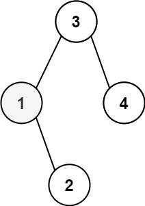
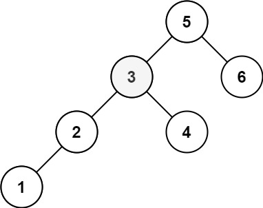

# [230. Kth Smallest Element in a BST](https://leetcode.com/problems/kth-smallest-element-in-a-bst/)

## Problem

Given the `root` of a binary search tree, and an integer `k`, return the `kth` smallest value (1-indexed) of all the values of the nodes in the tree.


Example 1:



```
Input: root = [3,1,4,null,2], k = 1
Output: 1
```

Example 2:



```
Input: root = [5,3,6,2,4,null,null,1], k = 3
Output: 3
``` 

Constraints:

- The number of nodes in the tree is `n`.
- `1 <= k <= n <= 10^4`
- `0 <= Node.val <= 10^4`


## Solution

```go
func kthSmallest(root *TreeNode, k int) int {
	result := []int{}
	var inorder func(node *TreeNode)
	inorder = func(node *TreeNode) {
		if node == nil {
			return
		}
		if node.Left != nil {
			inorder(node.Left)
		}
		result = append(result, node.Val)
		if node.Right != nil {
			inorder(node.Right)
		}
	}
	inorder(root)
	return result[k-1]
}
```