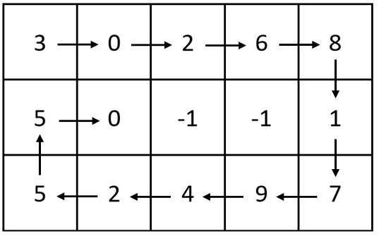
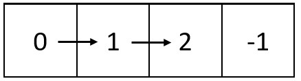

# [2326. Spiral Matrix IV](https://leetcode.com/problems/spiral-matrix-iv/)

## Problem

You are given two integers `m` and `n`, which represent the dimensions of a matrix.

You are also given the `head` of a linked list of integers.

Generate an `m x n` matrix that contains the integers in the linked list presented in spiral order (clockwise), starting from the top-left of the matrix. If there are remaining empty spaces, fill them with `-1`.

Return the generated matrix.

Example 1:



```
Input: m = 3, n = 5, head = [3,0,2,6,8,1,7,9,4,2,5,5,0]
Output: [[3,0,2,6,8],[5,0,-1,-1,1],[5,2,4,9,7]]
Explanation: The diagram above shows how the values are printed in the matrix.
Note that the remaining spaces in the matrix are filled with -1.
```

Example 2:



```
Input: m = 1, n = 4, head = [0,1,2]
Output: [[0,1,2,-1]]
Explanation: The diagram above shows how the values are printed from left to right in the matrix.
The last space in the matrix is set to -1.
``` 

Constraints:

- `1 <= m, n <= 10^5`
- `1 <= m * n <= 10^5`
- The number of nodes in the list is in the range `[1, m * n]`.
- `0 <= Node.val <= 1000`

## Solution

```go
func spiralMatrix(m int, n int, head *ListNode) [][]int {
	matrix := make([][]int, m)
	for i := range matrix {
		matrix[i] = make([]int, n)
	}
	for i := 0; i < m; i++ {
		for j := 0; j < n; j++ {
			matrix[i][j] = -1
		}
	}
	rowMin, rowMax := 0, m-1
	colMin, colMax := 0, n-1

	for head != nil {
		for j := colMin; j <= colMax; j++ {
			if head == nil {
				break
			}
			matrix[rowMin][j] = head.Val
			head = head.Next
		}
		rowMin++

		for i := rowMin; i <= rowMax; i++ {
			if head == nil {
				break
			}
			matrix[i][colMax] = head.Val
			head = head.Next
		}
		colMax--

		for j := colMax; j >= colMin; j-- {
			if head == nil {
				break
			}
			matrix[rowMax][j] = head.Val
			head = head.Next
		}
		rowMax--

		for i := rowMax; i >= rowMin; i-- {
			if head == nil {
				break
			}
			matrix[i][colMin] = head.Val
			head = head.Next
		}
		colMin++
	}

	return matrix
}
```