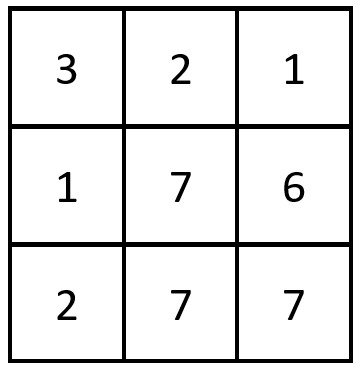
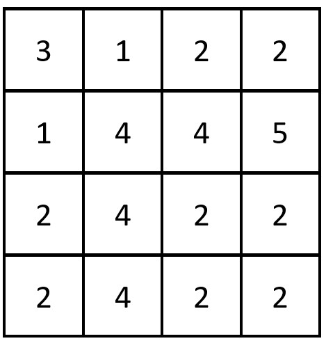

# [2352. Equal Row and Column Pairs](https://leetcode.com/problems/equal-row-and-column-pairs/)

## Problem

Given a 0-indexed `n x n` integer matrix `grid`, return the number of pairs `(ri, cj)` such that row `ri` and column `cj` are equal.

A row and column pair is considered equal if they contain the same elements in the same order (i.e., an equal array).

 
Example 1:



```
Input: grid = [[3,2,1],[1,7,6],[2,7,7]]
Output: 1
Explanation: There is 1 equal row and column pair:
- (Row 2, Column 1): [2,7,7]
```


Example 2:



```
Input: grid = [[3,1,2,2],[1,4,4,5],[2,4,2,2],[2,4,2,2]]
Output: 3
Explanation: There are 3 equal row and column pairs:
- (Row 0, Column 0): [3,1,2,2]
- (Row 2, Column 2): [2,4,2,2]
- (Row 3, Column 2): [2,4,2,2]
```

Constraints:

- `n == grid.length == grid[i].length`
- `1 <= n <= 200`
- `1 <= grid[i][j] <= 10^5`

## Solution

```go

func equalPairs(grid [][]int) int {
	n := len(grid)
	rowStrings := make(map[string]int)

	var sb strings.Builder
	for row := 0; row < n; row++ {
		sb.Reset()
		for col := 0; col < n; col++ {
			if col > 0 {
				sb.WriteString(",")
			}
			sb.WriteString(strconv.Itoa(grid[row][col]))
		}
		rowStrings[sb.String()]++
	}

	count := 0
	for col := 0; col < n; col++ {
		sb.Reset()
		for row := 0; row < n; row++ {
			if row > 0 {
				sb.WriteString(",")
			}
			sb.WriteString(strconv.Itoa(grid[row][col]))
		}
		if v, ok := rowStrings[sb.String()]; ok {
			count += v
		}
	}
	return count
}

```