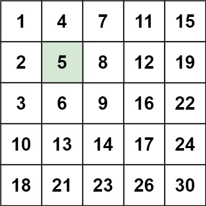
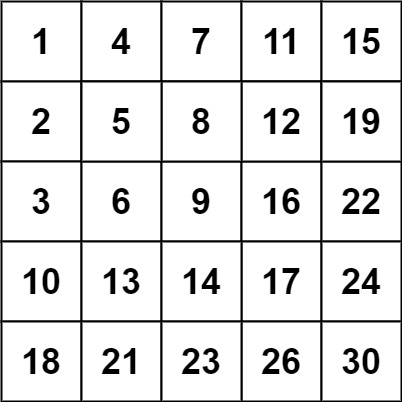

# [240. Search a 2D Matrix II](https://leetcode.com/problems/search-a-2d-matrix-ii/)

## Problem

Write an efficient algorithm that searches for a value `target` in an `m x n` integer matrix `matrix`. This matrix has the following properties:

- Integers in each row are sorted in ascending from left to right.
- Integers in each column are sorted in ascending from top to bottom.
 

Example 1:



```
Input: matrix = [[1,4,7,11,15],[2,5,8,12,19],[3,6,9,16,22],[10,13,14,17,24],[18,21,23,26,30]], target = 5
Output: true
```

Example 2:



```
Input: matrix = [[1,4,7,11,15],[2,5,8,12,19],[3,6,9,16,22],[10,13,14,17,24],[18,21,23,26,30]], target = 20
Output: false
``` 

Constraints:

- `m == matrix.length`
- `n == matrix[i].length`
- `1 <= n, m <= 300`
- `-10^9 <= matrix[i][j] <= 10^9`
- All the integers in each row are sorted in ascending order.
- All the integers in each column are sorted in ascending order.
- `-10^9 <= target <= 10^9`

## Solution

```go
func searchMatrix(matrix [][]int, target int) bool {
	row := 0
	col := len(matrix[0]) - 1

	for row < len(matrix) && col >= 0 {
		if matrix[row][col] == target {
			return true
		} else if matrix[row][col] > target {
			col--
		} else {
			row++
		}
	}
	return false
}
```