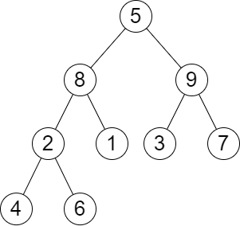
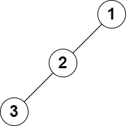

# [2583. Kth Largest Sum in a Binary Tree](https://leetcode.com/problems/kth-largest-sum-in-a-binary-tree/)

## Problem

You are given the `root` of a binary tree and a positive integer `k`.

The **level sum** in the tree is the sum of the values of the nodes that are on the same level.

Return the `kth` **largest** level sum in the tree (not necessarily distinct). If there are fewer than `k` levels in the tree, return `-1`.

Note that two nodes are on the same level if they have the same distance from the root.


Example 1:



```
Input: root = [5,8,9,2,1,3,7,4,6], k = 2
Output: 13
Explanation: The level sums are the following:
- Level 1: 5.
- Level 2: 8 + 9 = 17.
- Level 3: 2 + 1 + 3 + 7 = 13.
- Level 4: 4 + 6 = 10.
The 2nd largest level sum is 13.
```

Example 2:



```
Input: root = [1,2,null,3], k = 1
Output: 3
Explanation: The largest level sum is 3.
```

Constraints:

- The number of nodes in the tree is `n`.
- `2 <= n <= 10^5`
- `1 <= Node.val <= 10^6`
- `1 <= k <= n `

## Solution

```go
func kthLargestLevelSum(root *TreeNode, k int) int64 {
	queue := []*TreeNode{root}
	var levelSums []int64

	for len(queue) > 0 {
		levelSize := len(queue)
		var levelSum int64

		for i := 0; i < levelSize; i++ {
			node := queue[0]
			queue = queue[1:]
			levelSum += int64(node.Val)

			if node.Left != nil {
				queue = append(queue, node.Left)
			}
			if node.Right != nil {
				queue = append(queue, node.Right)
			}
		}

		levelSums = append(levelSums, levelSum)
	}

	if k > len(levelSums) {
		return -1
	}

	sort.Slice(levelSums, func(i, j int) bool {
		return levelSums[i] > levelSums[j]
	})

	return levelSums[k-1]
}
```