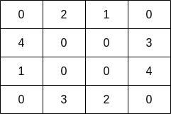
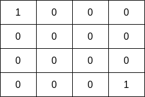

# [2658. Maximum Number of Fish in a Grid](https://leetcode.com/problems/maximum-number-of-fish-in-a-grid/)

## Problem

You are given a **0-indexed** 2D matrix `grid` of size `m x n`, where `(r, c)` represents:

- A land cell if `grid[r][c] = 0`, or
- A water cell containing `grid[r][c]` fish, if `grid[r][c] > 0.`

A fisher can start at any water cell `(r, c)` and can do the following operations any number of times:

- Catch all the fish at cell `(r, c)`, or
- Move to any adjacent **water** cell.

Return the *maximum* number of fish the fisher can catch if he chooses his starting cell optimally, or `0` if no water cell exists.

An adjacent cell of the cell `(r, c)`, is one of the cells `(r, c + 1)`, `(r, c - 1)`, `(r + 1, c)` or `(r - 1, c)` if it exists.


Example 1:



```
Input: grid = [[0,2,1,0],[4,0,0,3],[1,0,0,4],[0,3,2,0]]
Output: 7
Explanation: The fisher can start at cell (1,3) and collect 3 fish, then move to cell (2,3) and collect 4 fish.
```

Example 2:



```
Input: grid = [[1,0,0,0],[0,0,0,0],[0,0,0,0],[0,0,0,1]]
Output: 1
Explanation: The fisher can start at cells (0,0) or (3,3) and collect a single fish. 
```

Constraints:

- `m == grid.length`
- `n == grid[i].length`
- `1 <= m, n <= 10`
- `0 <= grid[i][j] <= 10`

## Solution

```go
func findMaxFish(grid [][]int) int {
	m, n := len(grid), len(grid[0])

	var dfs func(i, j int) int
	dfs = func(i, j int) int {
		if i < 0 || i >= m || j < 0 || j >= n || grid[i][j] == 0 {
			return 0
		}

		fish := grid[i][j]
		grid[i][j] = 0

		fish += dfs(i+1, j)
		fish += dfs(i-1, j)
		fish += dfs(i, j+1)
		fish += dfs(i, j-1)
		return fish
	}

	maxFish := 0

	for i := 0; i < m; i++ {
		for j := 0; j < n; j++ {
			if grid[i][j] > 0 {
				fish := dfs(i, j)
				if maxFish < fish {
					maxFish = fish
				}
			}
		}
	}
	return maxFish
}
```