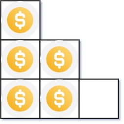
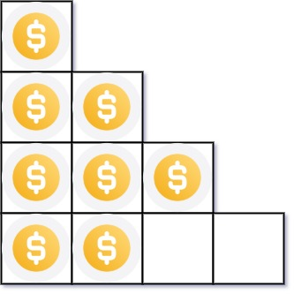

# [441. Arranging Coins](https://leetcode.com/problems/arranging-coins/)

## Problem

You have `n` coins and you want to build a staircase with these coins. The staircase consists of `k` rows where the `ith` row has exactly `i` coins. The last row of the staircase may be incomplete.

Given the integer `n`, return the number of complete rows of the staircase you will build.

 
Example 1:



```
Input: n = 5
Output: 2
Explanation: Because the 3rd row is incomplete, we return 2.
```

Example 2:



```
Input: n = 8
Output: 3
Explanation: Because the 4th row is incomplete, we return 3.
``` 

Constraints:

- `1 <= n <= 2^31 - 1`

## Solution

```go
func arrangeCoins(n int) int {
	i := 1
	for ; n >= 0; i++ {
		n -= i
	}
	return i - 2
}
```