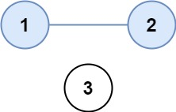
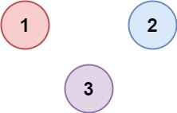

# [547. Number of Provinces](https://leetcode.com/problems/number-of-provinces/)

## Problem

There are `n` cities. Some of them are connected, while some are not. If city `a` is connected directly with city `b`, and city `b` is connected directly with city `c`, then city `a` is connected indirectly with city `c`.

A province is a group of directly or indirectly connected cities and no other cities outside of the group.

You are given an `n x n` matrix `isConnected` where `isConnected[i][j] = 1` if the `ith` city and the `jth` city are directly connected, and `isConnected[i][j] = 0` otherwise.

Return the total number of provinces.

Example 1:



```
Input: isConnected = [[1,1,0],[1,1,0],[0,0,1]]
Output: 2
```

Example 2:



```
Input: isConnected = [[1,0,0],[0,1,0],[0,0,1]]
Output: 3
```

Constraints:

- `1 <= n <= 200`
- `n == isConnected.length`
- `n == isConnected[i].length`
- `isConnected[i][j]` is `1` or `0`.
- `isConnected[i][i] == 1`
- `isConnected[i][j] == isConnected[j][i]`

## Solution

```go
func findCircleNum(isConnected [][]int) int {
    count := 0
    n := len(isConnected)
    visited := make([]bool, n)

    for start:=0; start<n; start++ {
        if !visited[start] {
            count += dfs(isConnected, visited, start)
        }
    }
    return count
}

func dfs(isConnected [][]int, visited []bool, start int) int {
    if visited[start] {
        return 0
    }
    count := 0
    visited[start] = true
    for dest:=0; dest<len(isConnected); dest++ {
        if isConnected[start][dest] == 1 && !visited[dest] {
            dfs(isConnected, visited, dest)
        }
    }
    count++
    return count
}
```