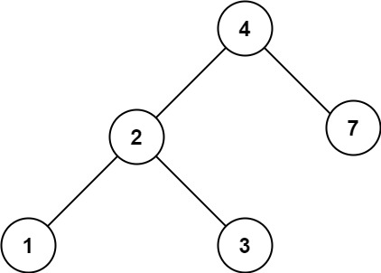

# [700. Search in a Binary Search Tree](https://leetcode.com/problems/search-in-a-binary-search-tree/)

## Problem

You are given the `root` of a binary search tree (BST) and an integer `val`.

Find the node in the BST that the node's value equals `val` and return the subtree rooted with that node. If such a node does not exist, return `null`.

Example 1:


```
Input: root = [4,2,7,1,3], val = 2
Output: [2,1,3]
```

Example 2:



```
Input: root = [4,2,7,1,3], val = 5
Output: []
```

Constraints:

- The number of nodes in the tree is in the range `[1, 5000]`.
- `1 <= Node.val <= 10^7`
- `root` is a binary search tree.
- `1 <= val <= 10^7`

## Solution

```go
/**
 * Definition for a binary tree node.
 * type TreeNode struct {
 *     Val int
 *     Left *TreeNode
 *     Right *TreeNode
 * }
 */
func searchBST(root *TreeNode, val int) *TreeNode {
    var traverse func(node *TreeNode, val int) *TreeNode
    traverse = func(node *TreeNode, val int) *TreeNode {
        if node == nil {
            return node
        }
        if node.Val == val {
            return node
        }
        if node.Val > val {
            return traverse(node.Left, val)
        }
        if node.Val < val {
            return traverse(node.Right, val)
        }
        return nil
    }
    return traverse(root, val)
}
```