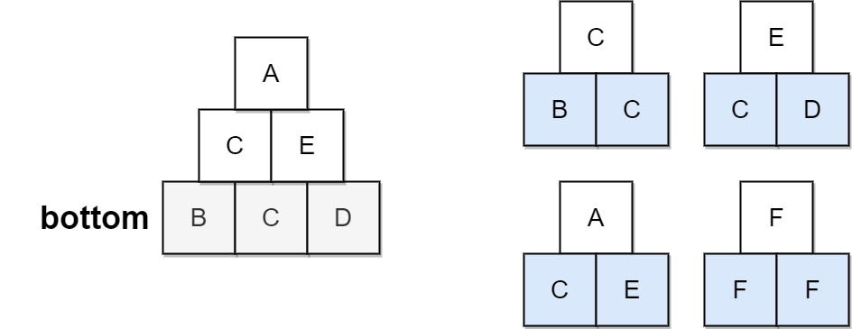
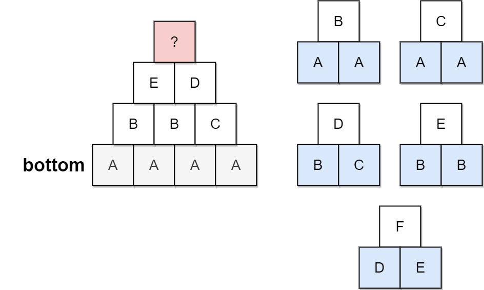

# [756. Pyramid Transition Matrix](https://leetcode.com/problems/pyramid-transition-matrix/)

## Problem

You are stacking blocks to form a pyramid. Each block has a color, which is represented by a single letter. Each row of blocks contains one less block than the row beneath it and is centered on top.

To make the pyramid aesthetically pleasing, there are only specific triangular patterns that are allowed. A triangular pattern consists of a single block stacked on top of two blocks. The patterns are given as a list of three-letter strings `allowed`, where the first two characters of a pattern represent the left and right bottom blocks respectively, and the third character is the top block.

- For example, `"ABC"` represents a triangular pattern with a `'C'` block stacked on top of an `'A'` (left) and `'B'` (right) block. Note that this is different from `"BAC"` where `'B'` is on the left bottom and `'A'` is on the right bottom.

You start with a bottom row of blocks `bottom`, given as a single string, that you **must** use as the base of the pyramid.

Given `bottom` and `allowed`, return `true` if you can build the pyramid all the way to the top such that every triangular pattern in the pyramid is in `allowed`, or `false` otherwise.

Example 1:



```
Input: bottom = "BCD", allowed = ["BCC","CDE","CEA","FFF"]
Output: true
Explanation: The allowed triangular patterns are shown on the right.
Starting from the bottom (level 3), we can build "CE" on level 2 and then build "A" on level 1.
There are three triangular patterns in the pyramid, which are "BCC", "CDE", and "CEA". All are allowed.
```

Example 2:



```
Input: bottom = "AAAA", allowed = ["AAB","AAC","BCD","BBE","DEF"]
Output: false
Explanation: The allowed triangular patterns are shown on the right.
Starting from the bottom (level 4), there are multiple ways to build level 3, but trying all the possibilites, you will get always stuck before building level 1.
``` 

Constraints:

- `2 <= bottom.length <= 6`
- `0 <= allowed.length <= 216`
- `allowed[i].length == 3`
- The letters in all input strings are from the set `{'A', 'B', 'C', 'D', 'E', 'F'}`.
- All the values of `allowed` are unique.

## Solution

```go
func pyramidTransition(bottom string, allowed []string) bool {
	validPatterns := make(map[string][]byte)
	for _, s := range allowed {
		key := s[:2]
		validPatterns[key] = append(validPatterns[key], s[2])
	}

	type PyramidState struct {
		currRow           string
		nextRowInProgress string
	}

	cachedResults := make(map[PyramidState]bool)

	var buildNextRow func(currRow string, nextRowInProgress []byte) bool
	buildNextRow = func(currRow string, nextRowInProgress []byte) bool {
		if len(currRow) == 1 {
			return true
		}
		if len(nextRowInProgress)+1 == len(currRow) {
			return buildNextRow(string(nextRowInProgress), []byte{})
		}

		state := PyramidState{currRow, string(nextRowInProgress)}
		if result, exists := cachedResults[state]; exists {
			return result
		}

		nextBlockIndex := len(nextRowInProgress)
		for _, topBlock := range validPatterns[currRow[nextBlockIndex:nextBlockIndex+2]] {
			if buildNextRow(currRow, append(nextRowInProgress, topBlock)) {
				cachedResults[state] = true
				return true
			}
		}

		cachedResults[state] = false
		return false
	}

	return buildNextRow(bottom, []byte{})
}
```