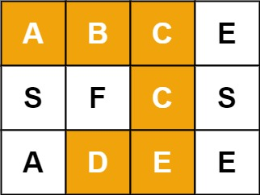

# [79. Word Search](https://leetcode.com/problems/word-search/)

## Problem

Given an `m x n` grid of characters `board` and a string `word`, return `true` if `word` exists in the grid.

The word can be constructed from letters of sequentially adjacent cells, where adjacent cells are horizontally or vertically neighboring. The same letter cell may not be used more than once.


Example 1:



```
Input: board = [["A","B","C","E"],["S","F","C","S"],["A","D","E","E"]], word = "ABCCED"
Output: true
```

Example 2:


```
Input: board = [["A","B","C","E"],["S","F","C","S"],["A","D","E","E"]], word = "SEE"
Output: true
```

Example 3:


```
Input: board = [["A","B","C","E"],["S","F","C","S"],["A","D","E","E"]], word = "ABCB"
Output: false
```

Constraints:

- `m == board.length`
- `n = board[i].length`
- `1 <= m, n <= 6`
- `1 <= word.length <= 15`
- `board` and `word` consists of only lowercase and uppercase English letters.

## Solution

```go
func exist(board [][]byte, word string) bool {
	row := len(board)
	col := len(board[0])
	directions := [][2]int{{0, 1}, {1, 0}, {-1, 0}, {0, -1}}

	var dfs func(i, j int, index int) bool
	dfs = func(i, j int, index int) bool {
		if index == len(word) {
			return true
		}

		if i < 0 || i >= row || j < 0 || j >= col || board[i][j] != word[index] {
			return false
		}

		temp := board[i][j]
		board[i][j] = '.'

		for _, d := range directions {
			r, c := i+d[0], j+d[1]
			if dfs(r, c, index+1) {
				return true
			}
		}

		board[i][j] = temp
		return false
	}

	for i := 0; i < row; i++ {
		for j := 0; j < col; j++ {
			if board[i][j] == word[0] && dfs(i, j, 0) {
				return true
			}
		}
	}
	return false
}
```