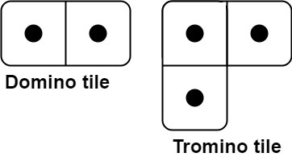

# [790. Domino and Tromino Tiling](https://leetcode.com/problems/domino-and-tromino-tiling/)

## Problem

You have two types of tiles: a `2 x 1` domino shape and a tromino shape. You may rotate these shapes.



Given an integer n, return the number of ways to tile an `2 x n` board. Since the answer may be very large, return it modulo `10^9 + 7`.

In a tiling, every square must be covered by a tile. Two tilings are different if and only if there are two 4-directionally adjacent cells on the board such that exactly one of the tilings has both squares occupied by a tile.


Example 1:


```
Input: n = 3
Output: 5
Explanation: The five different ways are show above.
```

Example 2:

```
Input: n = 1
Output: 1
``` 

Constraints:

- `1 <= n <= 1000`

## Solution

```go
import "math"

func numTilings(n int) int {
	mod := math.Pow10(9) + 7
	if n <= 2 {
		return n
	}
	dp := make([]int, n+1)
	dp[0] = 1
	dp[1] = 1
	dp[2] = 2
	dp[3] = 5

	for i := 4; i < n+1; i++ {
		dp[i] = (2*dp[i-1] + dp[i-3]) % int(mod)
	}

	return dp[n]
}
```