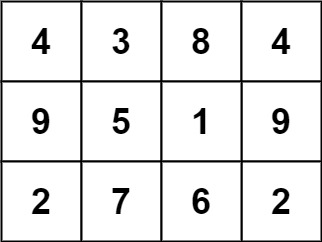
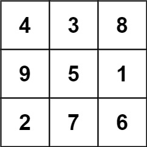
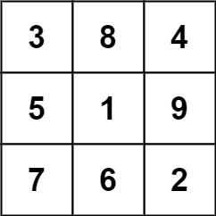

# [840. Magic Squares In Grid](https://leetcode.com/problems/magic-squares-in-grid/)

## Problem

A `3 x 3` magic square is a `3 x 3` grid filled with distinct numbers from 1 to 9 such that each row, column, and both diagonals all have the same sum.

Given a `row x col` `grid` of integers, how many `3 x 3` contiguous magic square subgrids are there?

Note: while a magic square can only contain numbers from 1 to 9, `grid` may contain numbers up to 15.


### Example 1:




Input: grid = [[4,3,8,4],[9,5,1,9],[2,7,6,2]]
Output: 1
Explanation: 
The following subgrid is a 3 x 3 magic square:



while this one is not:



In total, there is only one magic square inside the given grid.


### Example 2:

Input: grid = [[8]]
Output: 0


### Constraints:

- `row == grid.length`
- `col == grid[i].length`
- `1 <= row, col <= 10`
- `0 <= grid[i][j] <= 15`

## Solution

```go
func numMagicSquaresInside(grid [][]int) int {
	m, n := len(grid), len(grid[0])
	var result int

	isMagic := func(i, j int) bool {
		exist := make(map[int]bool)
		for r := i; r < i+3; r++ {
			for c := j; c < j+3; c++ {
				if grid[r][c] < 1 || grid[r][c] > 9 {
					return false
				}
				if exist[grid[r][c]] {
					return false
				}
				exist[grid[r][c]] = true
			}
		}

		for r := i; r < i+3; r++ {
			if grid[r][j]+grid[r][j+1]+grid[r][j+2] != 15 {
				return false
			}
		}

		for c := j; c < j+3; c++ {
			if grid[i][c]+grid[i+1][c]+grid[i+2][c] != 15 {
				return false
			}
		}

		if grid[i][j]+grid[i+1][j+1]+grid[i+2][j+2] != 15 {
			return false
		}
		if grid[i][j+2]+grid[i+1][j+1]+grid[i+2][j] != 15 {
			return false
		}

		return true
	}

	for i := 0; i <= m-3; i++ {
		for j := 0; j <= n-3; j++ {
			if isMagic(i, j) {
				result++
			}
		}
	}
	return result
}
```