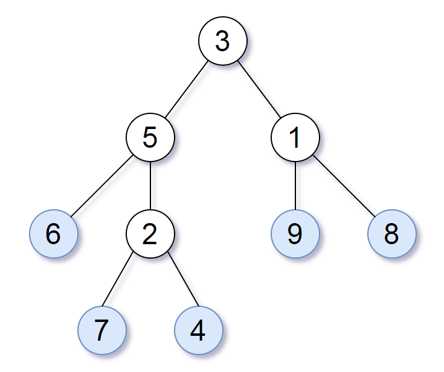

# [872. Leaf-Similar Trees](https://leetcode.com/problems/leaf-similar-trees/)

## Problem

Consider all the leaves of a binary tree, from left to right order, the values of those leaves form a leaf value sequence.



For example, in the given tree above, the leaf value sequence is `(6, 7, 4, 9, 8)`.

Two binary trees are considered leaf-similar if their leaf value sequence is the same.

Return `true` if and only if the two given trees with head nodes `root1` and `root2` are leaf-similar.

 

Example 1:


```
Input: root1 = [3,5,1,6,2,9,8,null,null,7,4], root2 = [3,5,1,6,7,4,2,null,null,null,null,null,null,9,8]
Output: true
```

Example 2:


```
Input: root1 = [1,2,3], root2 = [1,3,2]
Output: false
```

Constraints:

- The number of nodes in each tree will be in the range `[1, 200]`.
- Both of the given trees will have values in the range `[0, 200]`.

## Solution

```go
/**
 * Definition for a binary tree node.
 * type TreeNode struct {
 *     Val int
 *     Left *TreeNode
 *     Right *TreeNode
 * }
 */
func leafSimilar(root1 *TreeNode, root2 *TreeNode) bool {
    var dfs func(root *TreeNode, result *[]int)
    dfs = func(root *TreeNode, result *[]int) {
        if root == nil {
            return
        }

        if root.Left == nil && root.Right == nil {
            *result = append(*result, root.Val)
        }

        dfs(root.Left, result)
        dfs(root.Right, result)
    }

    oneResult := make([]int, 0)
    twoResult := make([]int, 0)
    dfs(root1, &oneResult)
    dfs(root2, &twoResult)

    return reflect.DeepEqual(oneResult, twoResult)
}
```