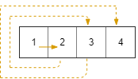
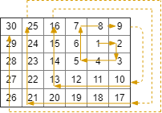

# [885. Spiral Matrix III](https://leetcode.com/problems/spiral-matrix-iii/)

## Problem

You start at the cell `(rStart, cStart)` of an `rows x cols` grid facing east. The northwest corner is at the first row and column in the grid, and the southeast corner is at the last row and column.

You will walk in a clockwise spiral shape to visit every position in this grid. Whenever you move outside the grid's boundary, we continue our walk outside the grid (but may return to the grid boundary later.). Eventually, we reach all `rows * cols` spaces of the grid.

Return an array of coordinates representing the positions of the grid in the order you visited them.


Example 1:



```
Input: rows = 1, cols = 4, rStart = 0, cStart = 0
Output: [[0,0],[0,1],[0,2],[0,3]]
```

Example 2:



```
Input: rows = 5, cols = 6, rStart = 1, cStart = 4
Output: [[1,4],[1,5],[2,5],[2,4],[2,3],[1,3],[0,3],[0,4],[0,5],[3,5],[3,4],[3,3],[3,2],[2,2],[1,2],[0,2],[4,5],[4,4],[4,3],[4,2],[4,1],[3,1],[2,1],[1,1],[0,1],[4,0],[3,0],[2,0],[1,0],[0,0]]
``` 

Constraints:

- `1 <= rows, cols <= 100`
- `0 <= rStart < rows`
- `0 <= cStart < cols`


## Solution

```go
func spiralMatrixIII(rows int, cols int, rStart int, cStart int) [][]int {
	directions := [][]int{{0, 1}, {1, 0}, {0, -1}, {-1, 0}}
	result := [][]int{{rStart, cStart}}
	if rows*cols == 1 {
		return result
	}

	steps := 0
	r, c := rStart, cStart

	for len(result) < rows*cols {
		for d := 0; d < 4; d++ {
			if d%2 == 0 {
				steps++
			}
			for i := 0; i < steps; i++ {
				r += directions[d][0]
				c += directions[d][1]

				if r >= 0 && r < rows && c >= 0 && c < cols {
					result = append(result, []int{r, c})
				}
				if len(result) == rows*cols {
					return result
				}
			}
		}
	}

	return result
}
```
