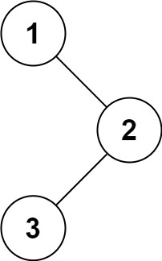

# [94. Binary Tree Inorder Traversal](https://leetcode.com/problems/binary-tree-inorder-traversal/)

## Problem

Given the `root` of a binary tree, return the inorder traversal of its nodes' values.

Example 1:



```
Input: root = [1,null,2,3]
Output: [1,3,2]
```

Example 2:

```
Input: root = []
Output: []
```

Example 3:

```
Input: root = [1]
Output: [1]
``` 

Constraints:

- The number of nodes in the tree is in the range `[0, 100]`.
- `-100 <= Node.val <= 100`
 
Follow up: Recursive solution is trivial, could you do it iteratively?

## Solution

```go
// --- Recursive ---
func inorderTraversal(root *TreeNode) []int {
	result := []int{}
	var traverse func(node *TreeNode)
	traverse = func(node *TreeNode) {
		if node == nil {
			return
		}

		traverse(node.Left)
		result = append(result, node.Val)
		traverse(node.Right)
	}

	traverse(root)

	return result
}
```

```go
// --- Iterative ---
func inorderTraversal(root *TreeNode) []int {
	result := []int{}

	queue := []*TreeNode{}
	curr := root
	for curr != nil || len(queue) > 0 {
		for curr != nil {
			queue = append(queue, curr)
			curr = curr.Left
		}
		curr = queue[len(queue)-1]
		queue = queue[:len(queue)-1]
		result = append(result, curr.Val)
		curr = curr.Right
	}

	return result
}
```