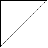
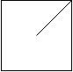
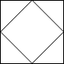

# [959. Regions Cut By Slashes](https://leetcode.com/problems/regions-cut-by-slashes/)

## Problem

An `n x n` grid is composed of `1 x 1` squares where each `1 x 1` square consists of a `'/'`, `'\'`, or blank space `' '`. These characters divide the square into contiguous regions.

Given the grid `grid` represented as a string array, return the number of regions.

Note that backslash characters are escaped, so a `'\'` is represented as `'\\'`.

Example 1:



```
Input: grid = [" /","/ "]
Output: 2
```

Example 2:



```
Input: grid = [" /","  "]
Output: 1
```

Example 3:



```
Input: grid = ["/\\","\\/"]
Output: 5
Explanation: Recall that because \ characters are escaped, "\\/" refers to \/, and "/\\" refers to /\.
``` 

Constraints:

- `n == grid.length == grid[i].length`
- `1 <= n <= 30`
- `grid[i][j]` is either `'/'`, `'\'`, or `' '`.


## Solution

```go
func regionsBySlashes(grid []string) int {
	n := len(grid)
	walls := make([][]bool, 4*n)
	for i := range walls {
		walls[i] = make([]bool, 4*n)
	}
	for i := 0; i < n; i++ {
		for j := 0; j < n; j++ {
			if grid[i][j] == '/' {
				walls[4*i][4*j+3] = true
				walls[4*i+1][4*j+2] = true
				walls[4*i+2][4*j+1] = true
				walls[4*i+3][4*j] = true
			} else if grid[i][j] == '\\' {
				walls[4*i][4*j] = true
				walls[4*i+1][4*j+1] = true
				walls[4*i+2][4*j+2] = true
				walls[4*i+3][4*j+3] = true
			}
		}
	}

	visited := make([][]bool, 4*n)
	for i := range visited {
		visited[i] = make([]bool, 4*n)
	}

	var dfs func(i, j int)
	dfs = func(i, j int) {
		if i < 0 || i >= 4*n || j < 0 || j >= 4*n || walls[i][j] || visited[i][j] {
			return
		}
		visited[i][j] = true
		dfs(i+1, j)
		dfs(i-1, j)
		dfs(i, j+1)
		dfs(i, j-1)
	}

	regions := 0
	for i := 0; i < 4*n; i++ {
		for j := 0; j < 4*n; j++ {
			if !walls[i][j] && !visited[i][j] {
				dfs(i, j)
				regions++
			}
		}
	}
	return regions
}
```