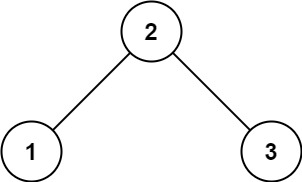

# [98. Validate Binary Search Tree](https://leetcode.com/problems/validate-binary-search-tree/)

## Problem

Given the `root` of a binary tree, determine if it is a valid binary search tree (BST).

A valid BST is defined as follows:

- The left subtree of a node contains only nodes with keys less than the node's key.
- The right subtree of a node contains only nodes with keys greater than the node's key.
- Both the left and right subtrees must also be binary search trees.


Example 1:



```
Input: root = [2,1,3]
Output: true
```

Example 2:


```
Input: root = [5,1,4,null,null,3,6]
Output: false
Explanation: The root node's value is 5 but its right child's value is 4.
```

Constraints:

- The number of nodes in the tree is in the range `[1, 10^4]`.
- `-2^31 <= Node.val <= 2^31 - 1`

## Solution

```go
func isValidBST(root *TreeNode) bool {
	return isValidBSTHelper(root, math.MinInt64, math.MaxInt64)
}

func isValidBSTHelper(node *TreeNode, minVal, maxVal int) bool {
	if node == nil {
		return true
	}

	if node.Val >= maxVal || node.Val <= minVal {
		return false
	}
	return isValidBSTHelper(node.Left, minVal, node.Val) && isValidBSTHelper(node.Right, node.Val, maxVal)
}
```